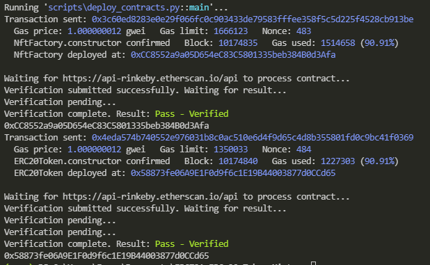
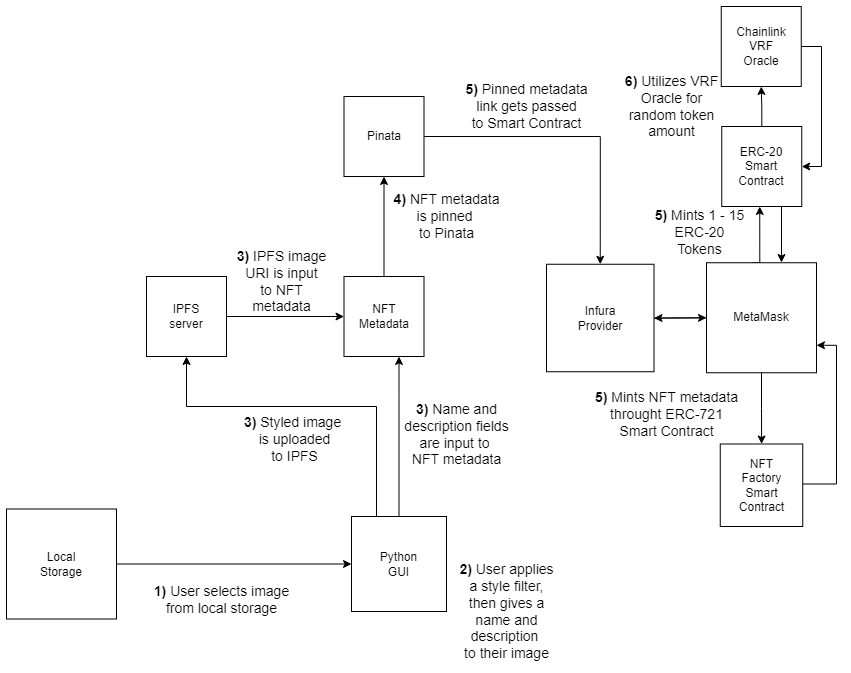

# ERC-721 + ERC-20 Token Minter Gui
This project gives users an all in one NFT creation experience, and consists of two smart contracts. The first is a NFT Factory contract that depends on OpenZeppelin's ERC-721 libraries. The second is an ERC-20 token contract that incentivizes users to mint their NFT's through the program. Users can apply basic style filters to their .PNG or .JPG, give a name and description, and then mint it onto any EVM compatible network. When a user mints an NFT, they are awarded 1 to 15 ERC-20 tokens determined randomly by a Chainlink VRF oracle.

This project is still in its infancy, so no smart contracts exist on-chain, however, both contracts are provided in the repo and can be deployed to test the GUI's functionality. Steps are provided below. 

*NOTE: This has only been tested on the Rinkeby network, but out of the box support for other networks will be added.* 

This project is a Chainlink, 2021 Fall Hackathon winner. https://devpost.com/software/erc-20-erc-721-token-minter-gui

# Project Requirements  
1) MetaMask - https://metamask.io/faqs/   
 - Obtain Rinkeby ETH and LINK - https://faucets.chain.link/rinkeby  
3) Provider (choose one from below):   
 - Infura - https://infura.io/  
 - Alchemy - https://www.alchemy.com/  
 - Moralis - https://moralis.io/speedy-nodes/   
4) Etherscan API Key - https://etherscan.io/myapikey  
5)  Pinata - https://docs.pinata.cloud/
6)  IPFS command-line - https://docs.ipfs.io/install/command-line/#official-distributions

# Setup Steps  

### 1) Clone repository  
~~~
git clone https://github.com/McManOfTheLand/ERC721-ERC-20-Token-Minter
~~~
### 2)  Create and activate python virtual enviroment  
~~~
python3 -m venv venv
./venv/scripts/activate
~~~
### 3)  Install packages  
~~~
pip install -r requirements.txt
~~~

### 4) Create .env file  
Inside the root directory of your project, create a .env file. Add API keys as well as your MetaMask accounts private key.

 
### 5) Deploy contracts  
To set the name and symbol for smart contracts, navigate to the `ERC721-ERC-20-Token-Minter/scripts/deploy_contracts.py` folder and change the deployment parameters that will ultimately get passed to the smart contract's constructor.  
Deploy contracts to the Rinkeby network:
~~~
brownie run scripts/deploy_contracty.py --network rinkeby
~~~
A successful deployment to the Rinkeby test network should look something like this:  
  
### 6) Fund ERC-20 token contract instance with LINK 
This is an imperative step. Not doing so will result in the program crashing when you try and mint an NFT.   
### 7) Start IPFS server  
In a new terminal, run the command:  
~~~
ipfs daemon
~~~
### 8) Start GUI   
Run the command:  
~~~
brownie run scripts/start_gui.py --network rinkeby
~~~
### 9) Get image from local storage   
Click on "browse" to select an image with the extension .PNG or .JPG.  
  
### 10) Stage an image   
Select a style using the checkboxs. Then click "stage" to add image to the minting area with the style you've selected. If you want to unstage an image, click "delete" to remove it from the minting area.
  
### 11) Give your NFT a name and description  
Use the provided dialogue boxes to give a name and description to your NFT.
 
### 12) Completion 
If you followed the above steps correctly, your console should look something like this:

### A successfull transaction means  
You can view your NFT at https://testnets.opensea.io/account (make sure you are connected to the OpenSea rinkeby testnet).  
Your wallet gains from 1 and 15 ERC-20 Tokens from the contract you previously deployed.

Blockchains can take time. If you are not seeing your NFT or tokens immedietly, check back in several mintutes.
## Congragulations. You've done it!

### Project workflow  
Steps are numbered. Steps that have the same number are operations that are executed by the same trigger.

